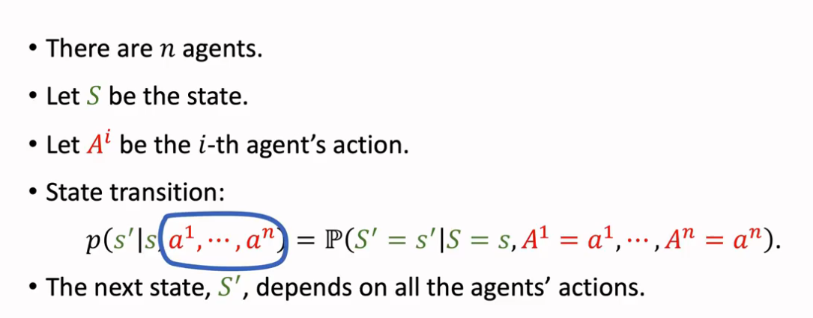
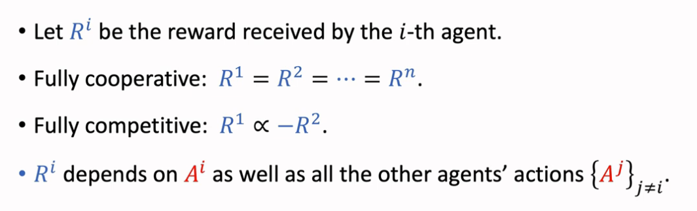
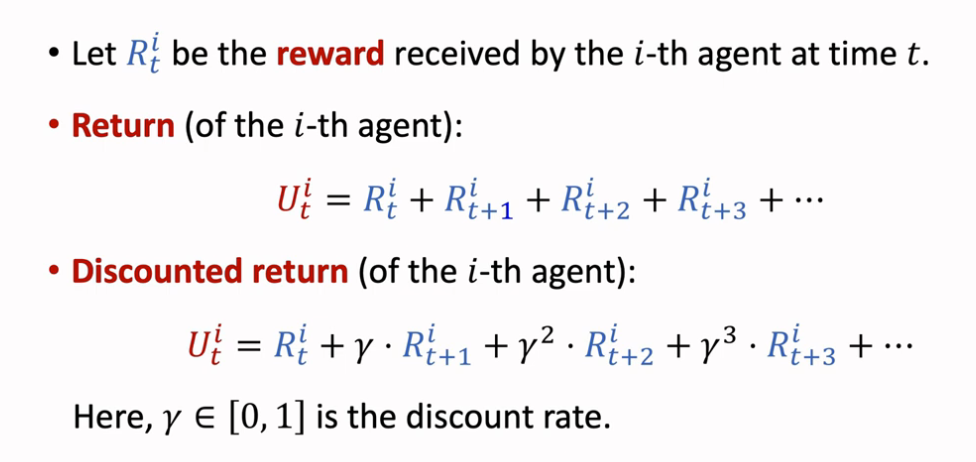
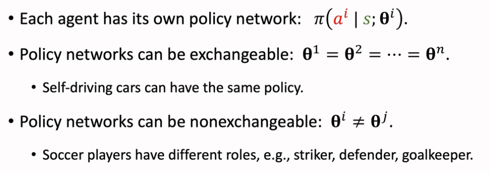
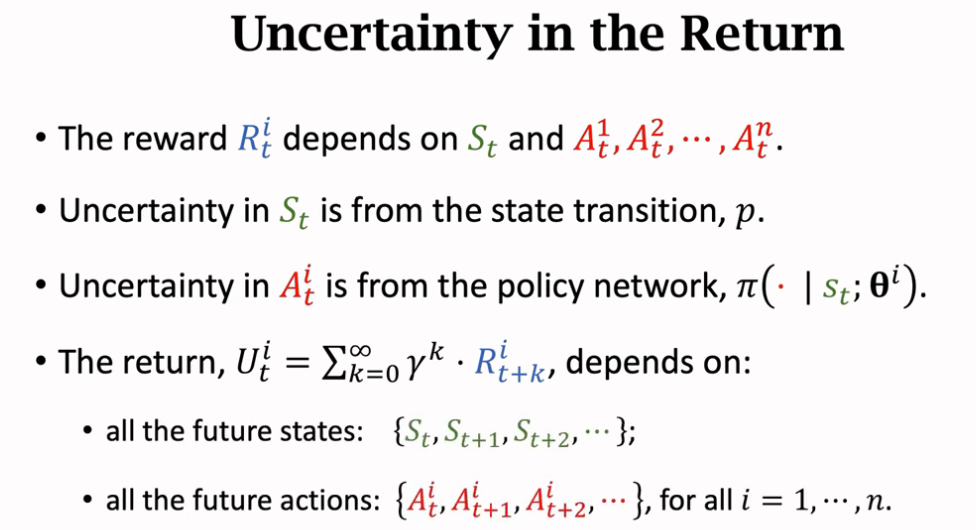

## 多智能体强化学习

1、合作关系 Fully cooperative——多个工业机器人协同装配汽车
2、竞争关系 Fully competitive——零和博弈，机器人搏斗；捕猎关系，捕猎者和被捕者之间获得的利益不同（一顿饭和一条命）不算 零和博弈
3、混合关系 Mixed Cooperative & competitive——比如多人团队对抗LOL
4、利己主义 Self-interested——一个系统里有多个智能体，一个智能体的动作会改变环境状态，可能会让别的智能体利益受损或获益，但他只在意自己能获得最大的利益，例如股市的自动交易、无人车的自动驾驶

 

最后一点的例子比如足球比赛的乌龙球

 