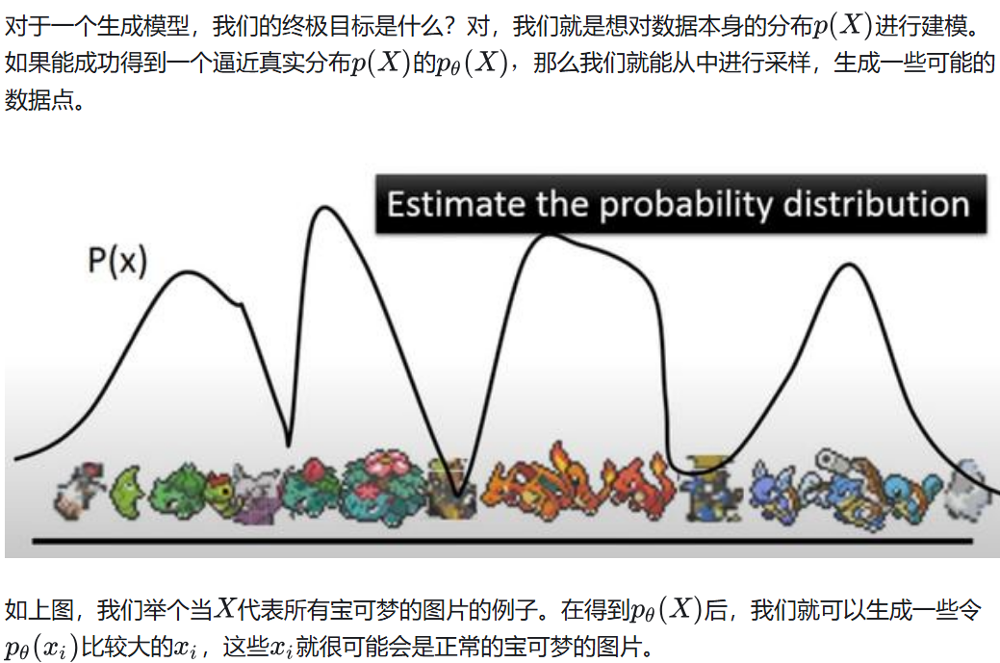

编码器$z=g(X)$，解码器$\tilde{X}=f(z)$，目标是进行分布之间的变换，$\tilde{X}和X$尽可能接近，即损失函数为$l=\Vert {X-\tilde{X}}\Vert^2$

出于方便，假设现在我们的输入$X∈ \mathbb{R}^{C \times H \times W}$是一些图片，我们可以训练一个自编码器。它的编码$z = g(X)$将每个图片编码成，$z \in \mathbb{R}^d$，它的解码器$\tilde{X} = f(z)$利用$z$将输入的图片重建为$\tilde{X} \in \mathbb{R}^{C \times H \times W}$。

这个解码器只需要输入某些低维向量$z$，就能够输出高维的图片数据$X$。那我们能否把这个模型直接当做生成模型，在低维空间$\mathbb{R}^d$中随机生成某些向量$z$，再喂给解码器$f(z)$来生成图片呢？

答案是，我们可以这么做，运气好的话我们可以得到一些有用的图片，但是对绝大多数随机生成的$z$，$f(z)$只会生成一些没有意义的噪声。

为什么会这样呢？这是因为我们没有显性的对$z$的分布$p(z)$进行建模，我们并不知道哪些$z$能够生成有用的图片。我们用来训练$f(z)$的==数据是有限的==，$f$可能只会对极有限的$z$有响应。而$\mathbb{R}^d$又是一个太大的空间，如果我们只在这个空间上随机采样的话，我们自然不能指望总能恰好采样到能够生成有用的图片的$z$

比如猫的图片对应的$z$是$[0.1,0.5,0.7,0.3,0.2] \in \mathbb{R}^d$，狗对应的$z$是$[0.3,0.2,0.5,0.8,0.5] \in \mathbb{R}^d$。若在训练中只学习了这两个，则采样到[0.5,0.5,0.8,0.3,0.2]则会生成毫无意义的图片

图像的分布：假设彩色图像是64x64大小，则相当于图像的分布满足一个==多变量分布函数==，变量的总数是64x64x3。即每一个像素都是一个单变量分布，而整幅图像的所有像素构成了一个多变量分布。建模为多变量分布的好处之一是：帮助更好的formulate图像的生成过程。

图像的生成，可以看作是从一个多变量分布函数中进行随机采样。当我们使用照相机拍了一张照片，也就相当于从自然界中采样了一张图像。

 对于理想的Decoder生成模型，我们根据一批数据样本${X_1,X_2,X_3,...,X_n}$得到关于$X$的分布$p(X)$，这样就可以根据有限的样本来生成分布，并在采样后得到无数的类似的图片，但是很困难。所以改成$p(X)=\sum\limits_{z} p(X|Z)p(Z)$，假设$p(Z)$服从标准正态分布，从标准正态分布中采样一个$z$，然后根据$z$计算$X$。但是问题在于这个$z$是从标准正态分布中采样得到，我们无法知道一个特定的$z_k$属于哪一个$x$，故在生成后也无法确定重建的$x$就是$x_k$，训练也就没有意义。

所以